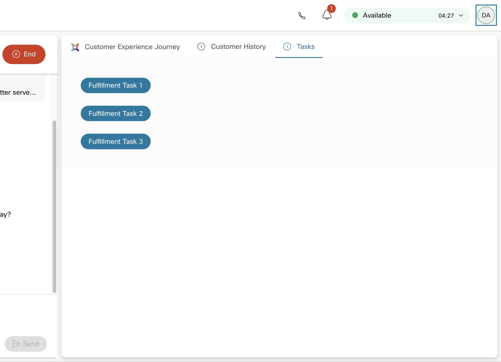
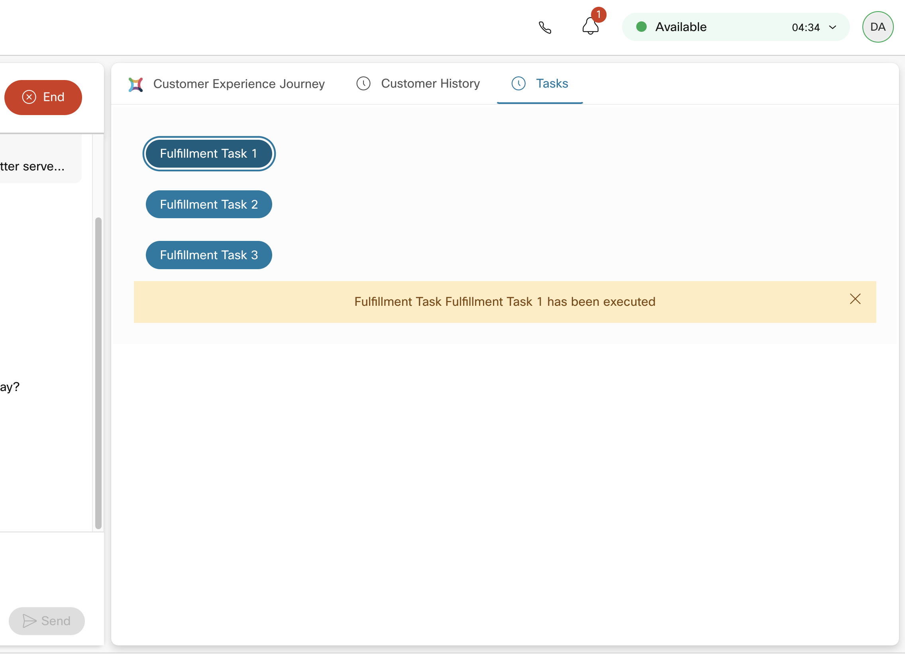

---
# WxCC Custom Widget: Fulfillment Tasks


## Introduction

Out of box WxCC Desktop currently offers triggering fulfilment tasks, but only for digital interactions. Triggering other processes for voice interactions requires custom widget, and this is an example of how that might be done. Initiation of business action is also written into customer history, while backend processes should continue writing history events and that way allow the agent visibility into external asynchronous process execution. Please check [rich customer history](https://github.com/dzlatic/rich-customer-history) component as well, for more details.



In this example, the agent can initiate business relevant actions during customer interaction of any type, with a simple click on the button.



After click, a visual indication that action is initiated is show to the agent.

In this version of the component, the buttons must be defined in the file, and the widget must be rebuilt and published for the set of buttons, per demo or production requirements. 

### Buttons Definition

In this version of the component, the buttons must be defined in the file, and the widget must be rebuilt and published for the buttons, per demo or production requirements. The [buttons.tsx](react/src/direflow-component/buttons.tsx) file contains an array of button definitions, with following JSON code:

```
    {
        name: string valie, name of the task to be shown on the button", 
        url: string value, URL of the fulfillment task webhook, typically created in IMI, but not limited to,
        active: boolean, false or true, in case you want to have some "fake" buttons, with no webhook defined
    }
```

Please keep in mind that your webhook URL will be supplied with following parameters in JSON body:

```
      { 
        preferredChannel: string value that yiou can use as selector in your flow
        msisdn: string valie, that you can use as the customer address on the selected channel       of further communication ,
        username: string value, a unique customer identifier in your CJaaS database. Please refer to rich customer history widget for more details.
        eventParent: string value of last parent event ID in customer history, so that you can attach child events in your webhook flow, if you want to.
      }
```

## Building & publishing the widget

Best way to start would be to review documentation: https://developer.webex-cx.com/documentation/guides/desktop and learn about building Custom Widgets.

1. The very first step would be to clone this repository: https://github.com/CiscoDevNet/webex-contact-center-widget-starter .

2. Replace all files in started widget repository with those provided in this repository and rename the root directory to “fulfillment-tasks”.

3. Edit "buttons.tsx" per your desired purpose.

4. Follow instructions from starter widget [README](react/README.md) file to build the component.

5. Once build, the component should be deployed on public URL, [AWS](https://aws.amazon.com/getting-started/hands-on/host-static-website/), [Google Cloud](https://cloud.google.com/storage/docs/hosting-static-website), [Microsoft Azure](https://docs.microsoft.com/en-us/azure/storage/blobs/storage-blob-static-website-host), [IBM Bluemix](https://www.ibm.com/cloud/blog/deploying-static-web-sites?mhsrc=ibmsearch_a&mhq=deploy%20static%20web%20page), [Heroku](https://gist.github.com/wh1tney/2ad13aa5fbdd83f6a489), [Digital Ocean](https://www.digitalocean.com/community/tutorials/how-to-deploy-a-static-website-to-the-cloud-with-digitalocean-app-platform) or any other option of your choice...


## Desktop Layout Configuration 

TBD

## How To Report Errors and Propose Improvements

Please contact Darko Zlatic (dzlatic@cisco.com).

